This tutorial will guide you through the basic steps needed for creating your first app. The process is easy: first you define the objects that your app will handle, and then you build the pages that will let users browse and manipulate such data.

### Step one: give a name to your app

Just [enter Bobuild](https://my.bobuild.com) and click the "Create app" button.

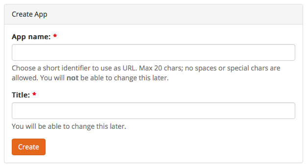

Choose a short app name. This will be used as the app domain: `https://APPNAME.bobuild.com/`

Now you need to go through two steps:

1. Design your database
2. Design your application pages

## Design your database

This step is easy. You define the objects and the fields that you want to store in your database.

An object is just an entity: for example, `customer`, `product`, or `order`.

Start creating your objects by clicking the *Add Object* button:

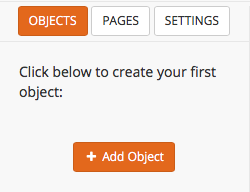

You'll be prompted for the object name:

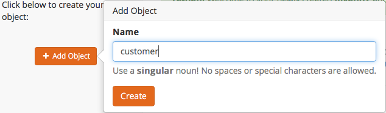

Now you need to define one or more object fields. Think about fields as the columns of a spreadsheet: they define the properties of your object. For example, a `customer` may have these fields: `name`, `lastname`, `address`, `email` and many more.
When you create an object, the `id` field will be created for you: it's a special field that you cannot change or delete. It's automatically populated with an incrementing number identifying the record uniquely.
Now add your first field by clicking the *Add Field* button:

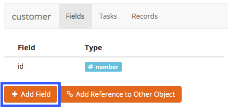

You will be prompted for the field name and type. Choose the type that best describes the data you'll put in this field:

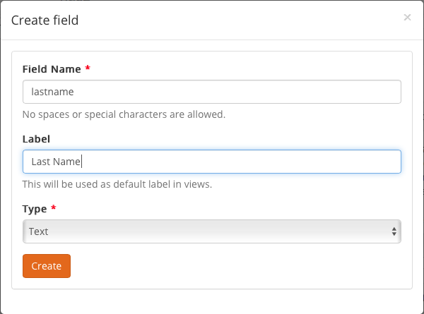

Repeat this step for all the desired fields.

For the purpose of this tutorial we're going to create the fields used to store some typical customer data: Last Name, Name, E-mail and Address.

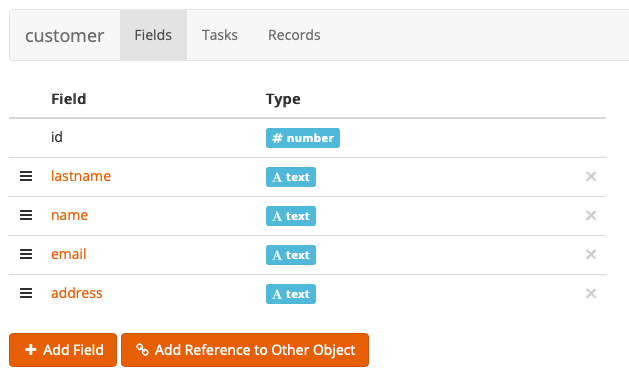

Please note that you can select a field type different from text, as E-mail, and the semantic of the field will be changed accordingly (we will deepen this point later on).

Now that we have our first object ready, let's create a page to fill in the data of our customers.

## Design your page

As done before with the the Object, this time click the *Add Page* button:

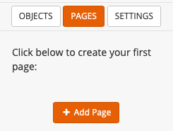

Specify the page name:

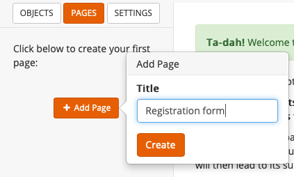

Ignore for the moment the message "This page is not protected by a login.". We will see how to create a login page in a future tutorial.

To the right you can find a list of the many views you can add to the page. Each view consists in a different way to process and display in a page the informations about an object.

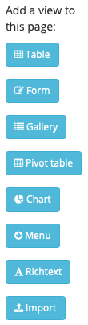

As we want to create a form to fill in customer data. drag the *Form* view to the empty page.

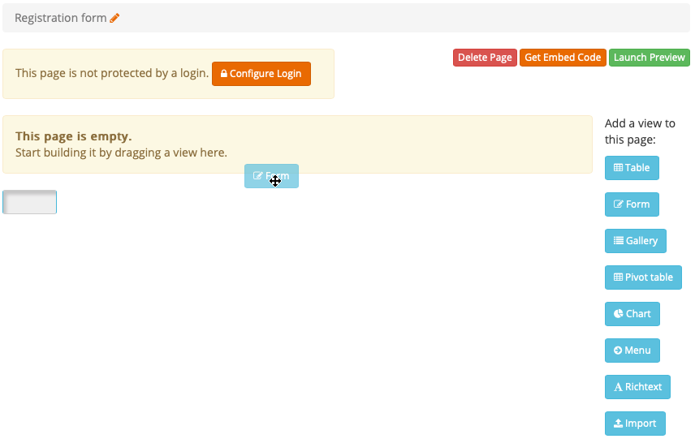

Confirm that this form will create a new record in the *Customer* object.

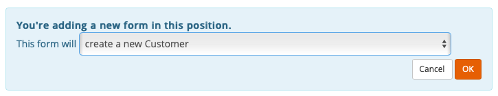

To set the details of the form, click on its empty space.

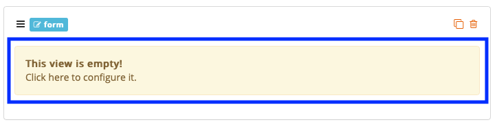

In the new dialog, you can find to the right the list of the fileds of the Object *Customer* that you've linked the form to. Let's first create a Group clicking the *Group* button. A group is a container for one or more fields of the form.

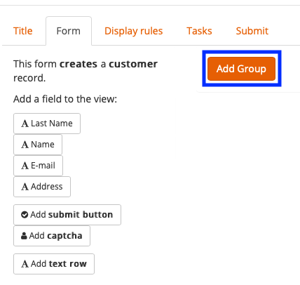

Now you can drag the fields of the Object to the Group you've just created. Let's start with Last Name

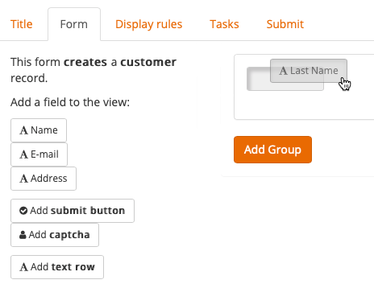

Do the same for all the other fields: Name, E-mail and Address. Do not forget to add a "Submit" button as well, so you can submit the data once filled in the form. And - voilà - our form is ready! We will see how to customize it with titles and other stuff in the future, but it's already functioning.

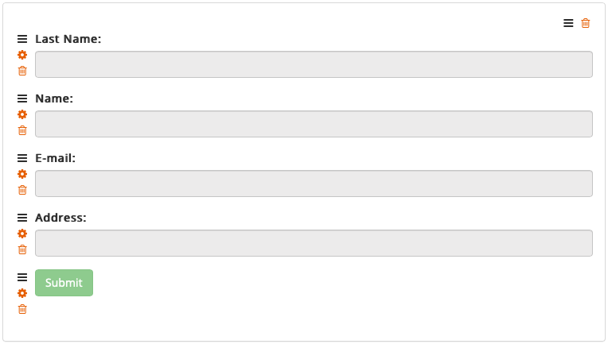

Click the "Close this dialog" button on the upper right side of the page and return to the previous screen. Here, you will see a preview of the page with the form you've just created.

Click the *Launch Preview* button an it will open a new browser tab with the form, ready to be used. Try to fill in some data and create some customer.

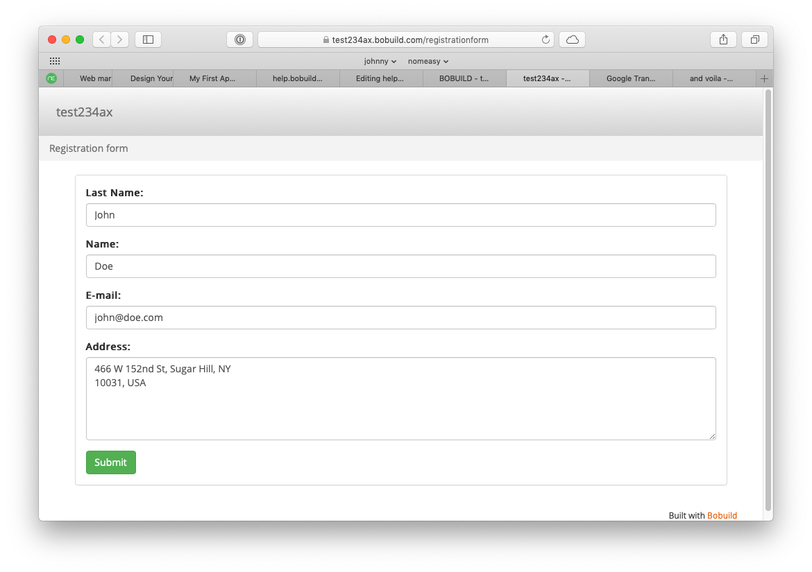

Note that if you insert an e-mail address that is formally wrong it won't be accepted.

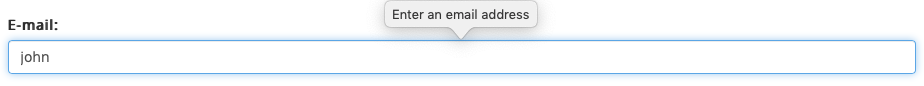

Objects have relationships among them: each **order** belongs to a single **customer**, while each **product** may be associated with **multiple orders**.

