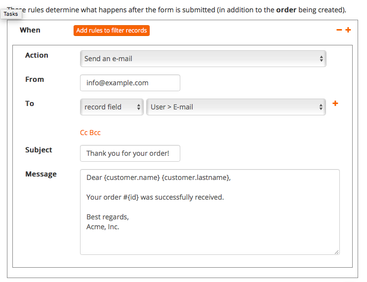

The e-mail feature of Bobuild is great for sending workflow notifications or reminders. E-mail tasks are configured in the builder in the following ways, like every other kind of task:

* **whenever a form is submitted** (either for creating or updating a record);
* bulk messages can be sent for multiple records by letting users pick them with **checkboxes in a table**;
* bulk messages can also be sent by configuring an object task that you can **run manually** or according to a **cron schedule**.

**Filters** can be used to select the records for which an e-mail should be generated.
**Placeholders** and **functions** can be used to customize the text by embedding dynamically generated text.

## Examples

You might want to send an e-mail in the following circumstances:

* whenever an user submits an order, you send both a receipt to them and a notification to your employees;
* whenever you ship an order, you send a notification to the user;
* after you close a Call for Papers, you send a "Thank you" e-mail to all applicants;
* after you apply evaluation to all the application, you send an acceptance notification to all applications with more than four stars and a rejection notification to the others;
* the week before your event, you send a reminder to all the attendees who didn't enter their car plates in their reserved area within your Bobuild app.

## Configuring an E-mail Task

As you can see in the above screenshot, **rules** can be set for limiting the subset of records for which an e-mail will be sent. In case of forms, which affect one record at most, rules will determine whether an e-mail will be sent or not. This way you can configure multiple e-mail tasks for a single form, which take place according to distinct rules.

**Recipients** can be set to fixed values or to dynamic values taken from the record itself. In the screenshot, we are using an object field as recipient e-mail.

## Placeholders

In order to customize the subject and the body of your message, placeholders can be used to embed values taken from the record itself. The syntax of a placeholder is `{FIELD_NAME}` where `FIELD_NAME` is the name of the object field you want to embed. For example, `{name}`, `{lastname}` are valid field names.

Note that field names must belong to the current object, i.e. the object that your form is creating/updating or the object for which you created the task. In the screenshot above, the form is creating a new *order* record, thus the message body contains a `{id}` placeholder that embeds the ID of the newly created order.

In order to access linked objects' fields, you can use the dot-syntax to go up the chain. For example, suppose that your *order* object has a reference field that links a *customer* object (each order belongs to a customer), and that field is called `customer`. In this case we'd use the syntax `{customer.name}` to reference the `name` field of the record referenced by the current record's `customer` field. This can be go beyond one level so you can do things like `{foo.bar.baz}` as you need.

## Functions

Sometimes you need to apply some transforms to the values before inserting them into your message. For example, you might want to make a string uppercase. It's easy: just type `{name:upper}`.

Basically, functions can be appended to placeholders with a double colon and their name. Multiple functions can be chained, like in `{lastname:trim:upper}`.

### Functions to be used on text fields:

* `:lower`: returns the given string in lower case.
* `:upper`: returns the given string in upper case.
* `:substr(FROM)` or `:substr(FROM, LEN)`: returns the substring starting from the given FROM char for the given LEN characters (or to the end of the string if not specified). For example `:substr(2)` will remove the first two characters (0 is the first, 1 is the second).
* `:trim`: removes whitespace from the beginning and the end of the string.
* `:ifempty('VALUE')`: returns the input string if not empty, otherwise the given value. This can be used for setting defaults.
* `:regexp_extract('REGEX')`: applies the given regular expression to the input value and returns the first capture. For example `:regexp_extract('(..)$')` will return the last two chars.
* `:regexp_replace('REGEX', 'REPLACE')`: looks for the given regular expression and applies the given replacement string. For example `:regexp_replace(' ', '_')` replaces all spaces with underscores.
* `:lpad(LEN, 'CHAR')`: left-pads the given string in order to make it at least LEN characters long by prepending the given character.
* `:md5`: computes the MD5 of the given string (in hex representation).

### Functions to be used on date/time fields:

* `:format('FORMAT')`: this function can be applied on date/time values and it lets you render them in the given format. For example `:format('Y')` will just return the year. Valid format specifiers are `Y`, `m`, `d`, `H`, `i`, `s`. This function will return a text value, so the above functions can be used.
* `:add_days(NUM)`: adds the given number of days to the input date.
* `:sub_days(NUM)`: subtracts the given number of days from the input date.
* `:days_to(DATE)`: calculates the difference in days between the input date and the given one.

Do you need a function that is not implemented yet? [Tell us](https://www.bobuild.com/contact/) ;-)
